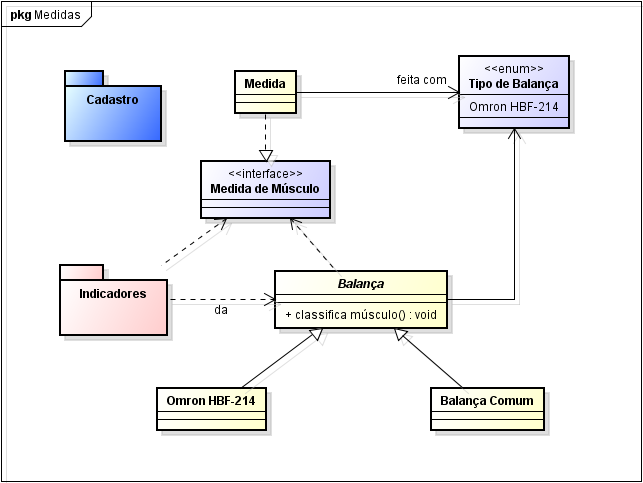
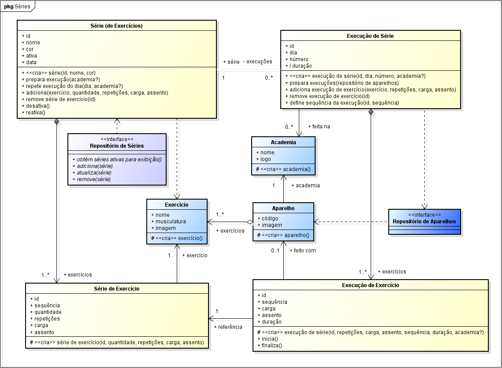

# Monstros Club

Monstros Club é uma aplicação que permite as pessoas monitorarem sua saúde através de um jeito diferente.

# Funcionalidades

## Problemas

Sem um acompanhamento das nossas atividades saudáveis é difícil de saber se estamos nos desenvolvendo ou não.

## Objetivos

Monitoramento da saúde através do monitoramento de medidas, séries e treinos.
Compartilhamento de resultados.

## Motivação

Execução de séries da maneira mais prática possível.
Competição consigo mesmo e com demais monstros.

# Casos de uso

# Modelos
## De domínio

### De domínio de medidas

### De domínio de séries

## Configurar o ambiente de desenvolvimento
* npm install -g angular/cli

* git clone https://github.com/mardsystems/monstros.club.git
* cd monstros.club
* npm install

* ng serve -o

## Publicação
* npm install -g firebase-tools

* firebase login
* firebase init
* firebase deploy

## Compilação e publicação
* npm run deploy

## Development server

Run `ng serve` for a dev server. Navigate to `http://localhost:4200/`. The app will automatically reload if you change any of the source files.

## Code scaffolding

Run `ng generate component component-name` to generate a new component. You can also use `ng generate directive|pipe|service|class|guard|interface|enum|module`.

## Build

Run `ng build` to build the project. The build artifacts will be stored in the `dist/` directory. Use the `--prod` flag for a production build.

## Running unit tests

Run `ng test` to execute the unit tests via [Karma](https://karma-runner.github.io).

## Running end-to-end tests

Run `ng e2e` to execute the end-to-end tests via [Protractor](http://www.protractortest.org/).

## Further help

To get more help on the Angular CLI use `ng help` or go check out the [Angular CLI README](https://github.com/angular/angular-cli/blob/master/README.md).

Este projeto foi gerado com [Angular CLI](https://github.com/angular/angular-cli) version 7.0.6.
