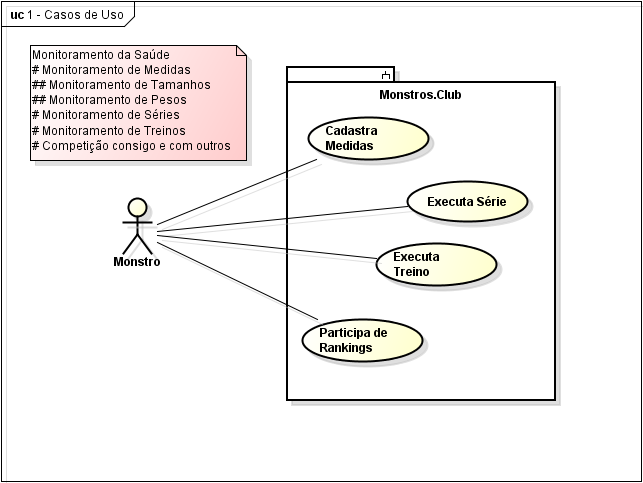

# Monstros Club

Monstros Club é uma aplicação que permite os monstros cadastrarem suas medidas (para monitoramento da saúde) e executar suas séries (previamente cadastradas).

# Funcionalidades

## Problemas

Sem um ... é difícil saber ...
Numa academia ou ... é difícil saber o que ...

## Objetivos

[Permitir o] Monitoramento da saúde.
[Permitir a] Execução de séries.

## Motivação

O monitoramento de saúde é compartilhado.
A execução de série é a melhor.

# Casos de uso

# Modelos de domínio
## Primeira versão

## Terceira versão

## Quarta versão

## Quinta versão
### Séries 2

## Configurar o ambiente de desenvolvimento
* npm install -g angular/cli

* git clone https://github.com/mardsystems/monstros.club.git
* cd monstros.club
* npm install

* ng serve -o

## Publicação
* npm install -g firebase-tools

* firebase login
* firebase init
* firebase deploy

## Compilação e Publicação
* npm run deploy

## Development server

Run `ng serve` for a dev server. Navigate to `http://localhost:4200/`. The app will automatically reload if you change any of the source files.

## Code scaffolding

Run `ng generate component component-name` to generate a new component. You can also use `ng generate directive|pipe|service|class|guard|interface|enum|module`.

## Build

Run `ng build` to build the project. The build artifacts will be stored in the `dist/` directory. Use the `--prod` flag for a production build.

## Running unit tests

Run `ng test` to execute the unit tests via [Karma](https://karma-runner.github.io).

## Running end-to-end tests

Run `ng e2e` to execute the end-to-end tests via [Protractor](http://www.protractortest.org/).

## Further help

To get more help on the Angular CLI use `ng help` or go check out the [Angular CLI README](https://github.com/angular/angular-cli/blob/master/README.md).

Este projeto foi gerado com [Angular CLI](https://github.com/angular/angular-cli) version 7.0.6.
